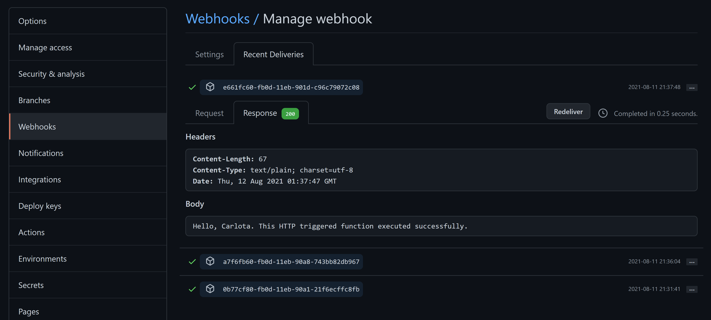
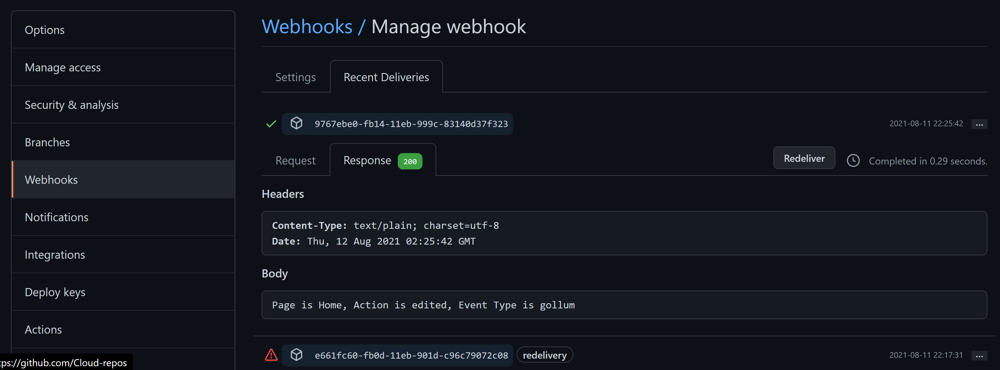
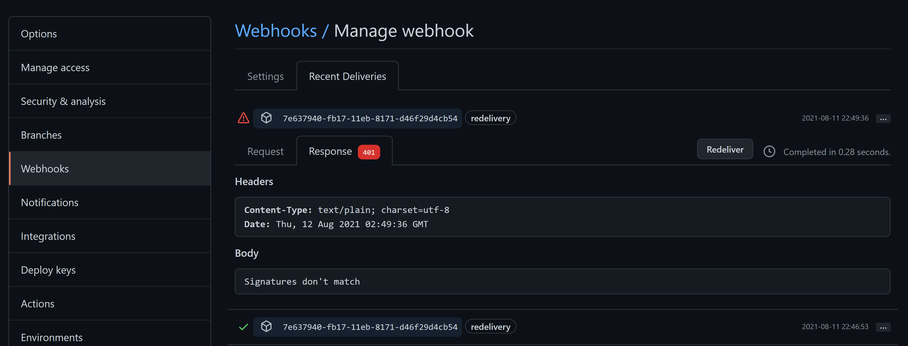

# LearnWebhookTest

[Monitor GitHub events by using a webhook with Azure Functions](https://docs.microsoft.com/en-us/learn/modules/monitor-github-events-with-a-function-triggered-by-a-webhook/) 

Exercise: [Create an Azure function triggered by a webhook](https://docs.microsoft.com/en-us/learn/modules/monitor-github-events-with-a-function-triggered-by-a-webhook/3-exercise-create-function-triggered-by-webhook)

Notes: This module required use of activating a sanbox and signing in to the Azure portal.

1. Create a Function App
2. Create a webhook triggered function
3. Test triggering the function by a URL

Successfully triggered the function by a URL. 

[Set up a webhook on Github repo](https://docs.microsoft.com/en-us/learn/modules/monitor-github-events-with-a-function-triggered-by-a-webhook/5-exercise-setup-webhook-for-github-repo)

1. Setup
2. Added a webhook for the Gollum event
3. Tested the webhook

[Triggered Azure Function with a Gollum event](https://docs.microsoft.com/en-us/learn/modules/monitor-github-events-with-a-function-triggered-by-a-webhook/7-exercise-trigger-function-with-github-event)

Secured the Webhook payloads with a [secret](https://docs.microsoft.com/en-us/learn/modules/monitor-github-events-with-a-function-triggered-by-a-webhook/8-secure-webhook-payloads-with-secret)

1. Obtained key for the Azure Function
2. Updated the webhook secret
3. Tested the webhook and the Azure Function
4. [Tested an invalid signature](https://docs.microsoft.com/en-us/learn/modules/monitor-github-events-with-a-function-triggered-by-a-webhook/9-exercise-secure-webhook-payloads-with-secret)

Output in the response tab, verified that the message "Signatures don't match" appears as the body of the response.

Summary: Covered benefits of webhooks. Created a function in Azure Functions triggered by a webhook. Set up a webhook for a GitHub repo (this one) and how to trigger the function with a GitHub event. Also learned how to protect the function using a secret.

